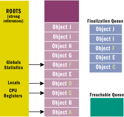
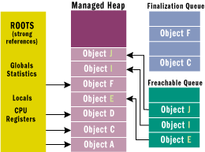
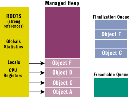

# Garbage Collector

---
<!-- _class: slide -->
# Memory allocation

* Garbage Collector (GC) allocates and releases memory.

* The runtime reserves a region of address space for the process called the managed heap.

* Objects are allocated in the heap contiguously one after another.

* Memory allocation is a very fast process as it is just the adding of a value to a pointer.

---
<!-- _class: slide -->
# Memory release

* The process of releasing memory is called garbage collection.

* GC releases only objects that are no longer in use by the application.

* To determine whether the object is used or not, GC examines application’s roots - strong references that are global to the application. Typically, these are global and static object pointers, local variables, and CPU registers..

---
<!-- _class: slide small -->
# Memory release


* For each active root, GC builds a graph that contains all the objects that are reachable from these roots.

* If an object is unreachable, GC considers it no longer in use and removes the object from the heap (releases the memory occupied by the object).

* After the object is removed, GC compacts reachable objects in memory.

---
<!-- _class: slide small4 -->
# Memory release

* Before a garbage collection starts, all managed threads are suspended except for the thread that triggered the garbage collection.


---
<!-- _class: slide small0 -->
# Generations
* For better performance of memory release, managed heap is divided into segments called generations: 0, 1 and 2.

* When objects are just created, they are placed to the Generation 0 (Gen 0).

* When Gen 0 is full (the size of the heap and generations is defined by GC), GC performs a garbage collection. During the collection, GC removes all unreachable objects from the heap. All reachable objects are promoted to the Generation 1 (Gen 1).

* The Gen 0 collection is a rather quick operation.

---
<!-- _class: slide small small2 -->
# Generations


* When Gen 1 is full, the Gen 1 garbage collection is performed. All objects that survive the collection are promoted to Gen 2. Gen 0 collection also takes place.

* When Gen 2 is full, GC performs full garbage collection. First, Gen 2 collection is performed, then Gen 1 and Gen 0 collections take place. If there is still not enough memory for new allocations, GC raises the OutOfMemory exception.

* During full garbage collection, GC has to pass through all objects in the heap, so, this process might have a great impact on system resources.

---
<!-- _class: slide small3 -->
# Large Object Heap

* Due to performance reasons, large objects (larger than 85 KB) are stored in a separate segment of the managed heap called Large Object Heap (LOH).

* Survived objects in LOH are not compacted (unless forced by developer). This means that LOH becomes fragmented over time.


---
<!-- _class: slide -->
# Finalization

* Finalization allows a resource to gracefully clean up after itself when it is being collected

* By using finalization, a resource representing a file or network connection is able to clean itself up properly when the garbage collector decides to free the resource's memory.

---
<!-- _class: slide -->
# Finalization

```
public class BaseObj {
    public BaseObj() { }

    protected override void Finalize() {
        // Perform resource cleanup code here... 
        // Example: Close file/Close network connection
        Console.WriteLine("In Finalize."); 
    }
}

class MyObject {
    ~MyObject() {
        // Perform resource cleanup code here...
    }
}
```

---
<!-- _class: slide small5 -->
# Finalization



* If the object's type contains a Finalize method, then a pointer to the object is placed on the finalization queue

* Some of these objects are reachable from the application's roots, and some are not.

---
<!-- _class: slide small6 -->
# Finalization



*  When a GC occurs, objects B, E, G, H, I, and J are determined to be garbage.

* If a pointer is found, the pointer is removed from the finalization queue and appended to the F-reachable queue

* There is a special runtime thread dedicated to calling Finalize methods.

---
<!-- _class: slide small6 -->
# Finalization



* The next time the garbage collector is invoked, it sees finalized objects as garbage, since the no root points to it and the freachable queue no points to it.

* **Two** GCs are required to reclaim memory used by objects that require finalization

---
<!-- _class: slide small small7 -->
# Disposable

```
class BaseClass : IDisposable {
    // To detect redundant calls
    private bool _disposed = false;

    ~BaseClass() => Dispose(false);

    // Public implementation of Dispose pattern callable by consumers.
    public void Dispose() {
        Dispose(true);
        GC.SuppressFinalize(this);
    }

    // Protected implementation of Dispose pattern.
    protected virtual void Dispose(bool disposing) {
        if (_disposed)
            return;
        if (disposing)
            // TODO: dispose managed state (managed objects).        }

        // TODO: free unmanaged resources (unmanaged objects) and override a finalizer below.
        // TODO: set large fields to null.
        _disposed = true;
    }
}
```