# SQL and MSSQL Server

---
<!-- _class: slide -->
# Structured Query Language (SQL)

See simple SQL tutorial [https://www.w3schools.com/sql/sql_intro.asp](https://www.w3schools.com/sql/sql_intro.asp)

---
<!-- _class: slide -->
# MSSQL RDBMS

SQL Server Layered architecture\
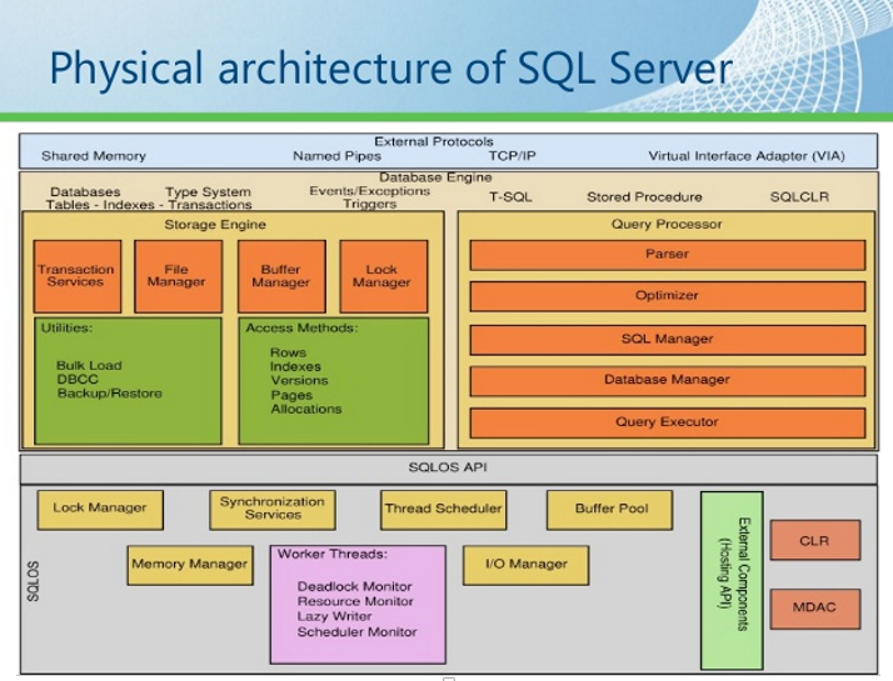

---
<!-- _class: slide -->
# MSSQL Entities

## Database
- **master Database** -	records all the system-level information for an instance of SQL Server.
- **msdb Database** - is used by SQL Server Agent for scheduling alerts and jobs.
- **model Database** - is used as the template for all databases created on the instance of SQL Server.
- **tempdb Database** -	is a workspace for holding temporary objects or intermediate result sets.

## Tables and Views
- Primary/Foreign keys
- Unique and Check Constraints
- A **View** is a virtual table whose contents are defined by a query

## Stored Procedures and Functions
- **Stored Procedures** - a group of one or more Transact-SQL statements or a reference to a Microsoft .NET Framework common runtime language (CLR) method.
    * Accept input parameters and return multiple values in the form of output parameters to the calling program.
    * Contain programming statements that perform operations in the database. These include calling other procedures.
    * Return a status value to a calling program to indicate success or failure (and the reason for failure).
- **Functions (User-Defined)** - routines that accept parameters, perform an action, such as a complex calculation, and return the result of that action as a value.
    * Scalar Function - return a single data value.
    * Table-Valued Functions - return a table data type.

## Triggers
- **Logon triggers** - fire stored procedures in response to a LOGON event.
- **DDL triggers** - fire stored procedures in response to a variety of Data Definition Language (CREATE, ALTER, DROP, GRANT, DENY, REVOKE or UPDATE STATISTICS) events.
- **DML triggers** - fire stored procedures in response to a variety of Data Manipulation Language (INSERT, UPDATE, or DELETE) events.

## Indexes
- **Heaps** - A heap is a table without a clustered index. One or more nonclustered indexes can be created on tables stored as a heap.
    * Data is retrieved from a heap in order of data pages, but not necessarily the order in which data was inserted.
- **Clustered & Nonclustered Indexes** - index on the table that stores data pages
    * Clustered indexes sort and store the data rows in the table or view based on their key values. There can be only one clustered index per table.  
    * The only time the data rows in a table are stored in sorted order is when the table contains a clustered index.
- **Columnstore Indexes** - Columnstore indexes are the standard for storing and querying large data warehousing fact tables.
    * High performance gains for analytic queries that scan large amounts of data
    * High data compression inside te index
- **Full-Text Indexes** - lets users and applications run full-text queries against character-based data in SQL Server tables.
    * Queries can use special T_SQL statements and syntax (CONTAINS, FREETEXT, NEAR)

---
<!-- _class: slide -->
# Storage principles
- Data Pages
    * In SQL Server, data is organized in pages.
    * A page has a fixed size (8 KB).
    * Each page contains records.
    * The number of records that can be stored in a page depends on the size of the records.
    * The operation of reading data from a page is called a logical IO.

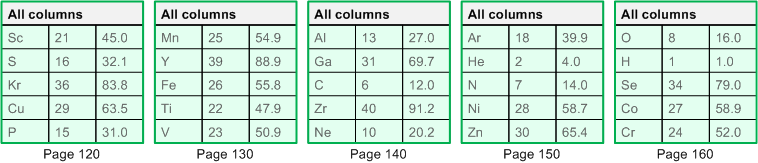

- **B-Tree structures** - SQL Server organizes indexes as trees, with one page at the root level, multiple pages at the leaf level, and zero or more levels in between.

    * Clustered Index B-Trees
        * Leaf level: The leaf level is the data of the table. It is composed of data pages. They store all the columns of the table for every row of the table.
        * Non-leaf levels: The non-leaf levels are composed of index pages.
    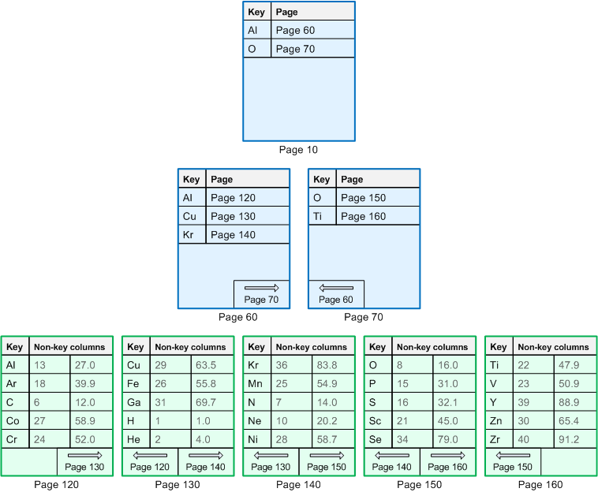

    * Nonclustered Index B-Trees
        * Leaf level: The leaf level is the data of the table. It is composed of data pages. They store all the columns of the table for every row of the table.
        * Non-leaf levels: The non-leaf levels are composed of index pages.

    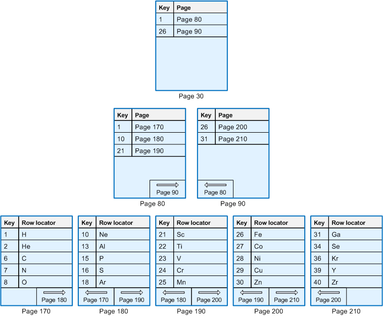\
    *A nonclustered index for the clustered table.*
    
    
    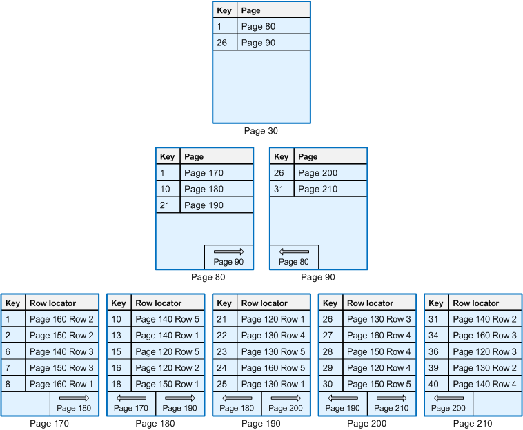\
    *A nonclustered index for the heap.*

The columns stored at the leaf of an index are called the columns covered by this index.

---
<!-- _class: slide -->
# Query Engine


A query execution plan is a definition of the following:
 - **The sequence in which the source tables are accessed**\
 `TableC`, `TableB`, `TableA`, or\
 `TableB`, `TableA`, `TableC`, or\
 `TableB`, `TableC`, `TableA`, or\
 `TableC`, `TableA`, `TableB`

 - **The methods used to extract data from each table** - If only a few rows with specific key values are required, the database server can use an index. If all the rows in the table are required, the database server can ignore the indexes and perform a table scan. If all the rows in a table are required but there is an index whose key columns are in an ORDER BY, performing an index scan instead of a table scan may save a separate sort of the result set. If a table is very small, table scans may be the most efficient method for almost all access to the table.

 - **The methods used to compute calculations, and how to filter, aggregate, and sort data from each table.** - As data is accessed from tables, there are different methods to perform calculations over data such as computing scalar values, and to aggregate and sort data as defined in the query text, for example when using a GROUP BY or ORDER BY clause, and how to filter data, for example when using a WHERE or HAVING clause.

 **Query Optimizer**
 - Cost-based optimizer
 - Optimizes resources cost (selects optimal plan in reasonable time)
 - Optimizes performance cost (resources vs parallelism)
 - Relies on distribution statistics (density of the underlying data)
 - Adjusts dynamically to changing conditions

## Advanced querying
While stored in a form of rows in table in a relational data store - the ways the data should be retreived and processed can vary a lot. For example assume calculating aggregations, applying transformation functions, paginating the data, apply advanced filtering - all these patterns require special table data treatment to run efficiently.

## Joins
SQL Server performs sort, intersect, union, and difference operations using in-memory sorting and hash join technology.

SQL Server implements logical join operations, as determined by Transact-SQL syntax:
 - Inner join (INNER JOIN)
 - Left outer join (LEFT [ OUTER ] JOIN)
 - Right outer join (RIGHT [ OUTER ] JOIN)
 - Full outer join (FULL [ OUTER ] JOIN)
 - Cross join (CROSS JOIN)

SQL Server employs four types of physical join operations to carry out the logical join operations:
 - Nested Loops joins
 - Merge joins
 - Hash joins
 - Adaptive joins (starting with SQL Server 2017 (14.x))

### Nested Loops joins
If one join input is small (fewer than 10 rows) and the other join input is fairly large and indexed on its join columns, an index nested loops join is the fastest join operation because they require the least I/O and the fewest comparisons.

**Non-sorted inputs**\


**Sorted input**\


### Merge joins
If the two join inputs are not small but are sorted on their join column (for example, if they were obtained by scanning sorted indexes), a merge join is the fastest join operation.

**Without duplicates in both inputs**\


**With duplicates in both inputs**\


### Hash joins
Hash joins can efficiently process large, unsorted, nonindexed inputs.

**In-Memory Hash Join**\


**Grace Hash Join**\
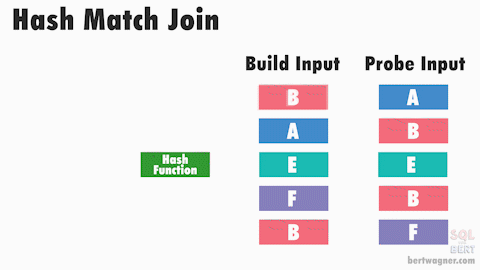

### Adaptive joins
Batch mode Adaptive Joins enable the choice of a Hash Join or Nested Loops join method to be deferred until after the first input has been scanned. The Adaptive Join operator defines a threshold that is used to decide when to switch to a Nested Loops plan.

## Subqueries
A subquery is a query that is nested inside a SELECT, INSERT, UPDATE, or DELETE statement, or inside another subquery.

```
SELECT Ord.SalesOrderID, Ord.OrderDate,
    (SELECT MAX(OrdDet.UnitPrice)
     FROM Sales.SalesOrderDetail AS OrdDet
     WHERE Ord.SalesOrderID = OrdDet.SalesOrderID) AS MaxUnitPrice
FROM Sales.SalesOrderHeader AS Ord;
```
* A subquery nested in the outer SELECT statement has the following components:
  - A regular `SELECT` query including the regular select list components.
  - A regular `FROM` clause including one or more table or view names.
  - An optional `WHERE` clause.
  - An optional `GROUP BY` clause.
  - An optional `HAVING` clause.
* The `SELECT` query of a subquery is always enclosed in parentheses.
* A subquery can be nested inside the `WHERE` or `HAVING` clause of an outer `SELECT`, `INSERT`, `UPDATE`, or `DELETE` statement, or inside another subquery. Up to 32 levels of nesting is possible.

**Subqueries With `IN` or `NOT IN`**\
The result of a subquery introduced with IN (or with NOT IN) is a list of zero or more values. After the subquery returns results, the outer query makes use of them.
```
SELECT Name
FROM Purchasing.Vendor
WHERE CreditRating = 1
AND BusinessEntityID IN
    (SELECT BusinessEntityID
     FROM Purchasing.ProductVendor
     WHERE MinOrderQty >= 20
     AND AverageLeadTime < 16);
```

**Subqueries in `UPDATE`, `DELETE`, and `INSERT` Statements**\
Subqueries can be nested in the UPDATE, DELETE, INSERT and SELECT data manipulation (DML) statements.
```
UPDATE Production.Product
SET ListPrice = ListPrice * 2
WHERE ProductID IN
    (SELECT ProductID 
     FROM Purchasing.ProductVendor
     WHERE BusinessEntityID = 1540);
```
**Subqueries with Comparison Operators**\
Subqueries can be introduced with one of the comparison operators (=, < >, >, > =, <, ! >, ! <, or < =).
```
SELECT Name
FROM Production.Product
WHERE ListPrice >
    (SELECT AVG (ListPrice)
     FROM Production.Product);
```

**Comparison Operators Modified by `ANY`, `SOME`, or `ALL`**\
Comparison operators that introduce a subquery can be modified by the keywords ALL or ANY. SOME is an ISO standard equivalent for ANY.

The =ANY operator is equivalent to IN
```
--Using =ANY
SELECT Name
FROM Production.Product
WHERE ProductSubcategoryID =ANY
    (SELECT ProductSubcategoryID
     FROM Production.ProductSubcategory
     WHERE Name = 'Wheels');

--Using IN
SELECT Name
FROM Production.Product
WHERE ProductSubcategoryID IN
    (SELECT ProductSubcategoryID
     FROM Production.ProductSubcategory
     WHERE Name = 'Wheels');
```

The <>ANY operator, however, differs from NOT IN: <>ANY means not = a, or not = b, or not = c. NOT IN means not = a, and not = b, and not = c. <>ALL means the same as NOT IN.
```
SELECT CustomerID
FROM Sales.Customer
WHERE TerritoryID <> ANY
    (SELECT TerritoryID
     FROM Sales.SalesPerson);
```

**Subqueries with EXISTS**\
When a subquery is introduced with the keyword EXISTS, the subquery functions as an existence test.
```
SELECT Name
FROM Production.Product
WHERE EXISTS
    (SELECT * 
     FROM Production.ProductSubcategory
     WHERE ProductSubcategoryID = 
            Production.Product.ProductSubcategoryID
        AND Name = 'Wheels');
```

**Subqueries Used in place of an Expression**\
In Transact-SQL, a subquery can be substituted anywhere an expression can be used in `SELECT`, `UPDATE`, `INSERT`, and `DELETE` statements, except in an `ORDER BY` list.
```
SELECT Name, ListPrice, 
(SELECT AVG(ListPrice) FROM Production.Product) AS Average, 
    ListPrice - (SELECT AVG(ListPrice) FROM Production.Product)
    AS Difference
FROM Production.Product
WHERE ProductSubcategoryID = 1;
```

### Window functions
SQL Server Window Functions calculate an aggregate value based on a group of rows and return multiple rows for each group.

**The `OVER` Clause**\
There are two options in the `OVER` clause that can cause sorting: `PARTITION BY` and ORDER BY. `PARTITION BY` is supported by all window functions, but it’s optional. The `ORDER BY` option in the `OVER` clause is required so that the database engine can line up the rows.

You can use the OVER clause with functions:
 - Ranking functions (RANK, ROW_NUMBER)
 - Aggregate functions (AVG, COUNT, MAX, MIN, SUM, STDEV)
 - Analytic functions (FIRST_VALUE, LAST_VALUE, LAG)

```
SELECT SalesOrderID, 
	TotalDue, 
	ROW_NUMBER() OVER(ORDER BY SalesOrderID) AS RowNum
FROM Sales.SalesOrderHeader;
 
SELECT SalesOrderID, 
	TotalDue, 
	ROW_NUMBER() OVER(ORDER BY TotalDue DESC) AS RowNum
FROM Sales.SalesOrderHeader;
```

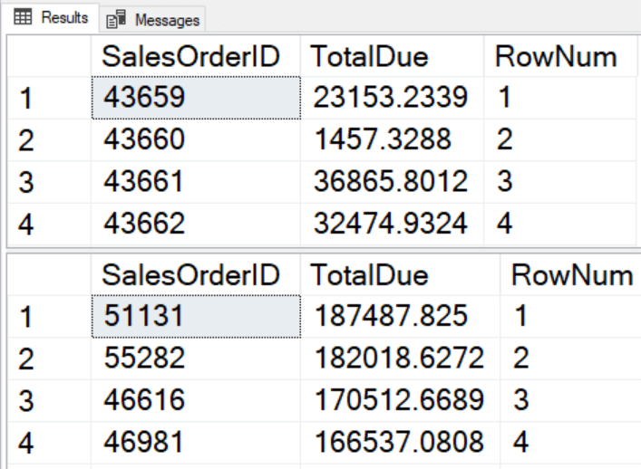

```
SELECT CustomerID,
	SalesOrderID, 
	TotalDue, 
	ROW_NUMBER() OVER(PARTITION BY CustomerID ORDER BY SalesOrderID) 
          AS RowNum
FROM Sales.SalesOrderHeader;
```

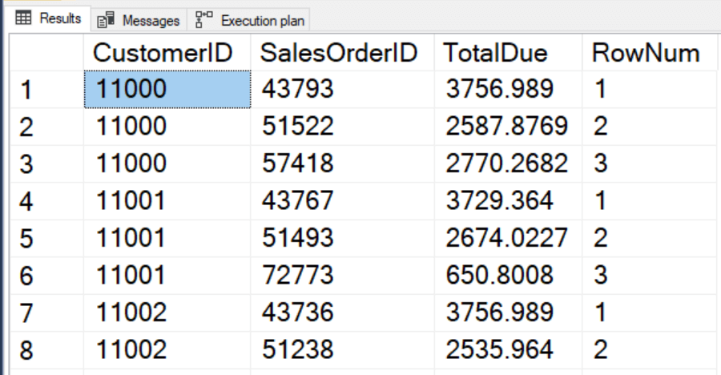

**Framing**\
Defines a window over which the function is applied

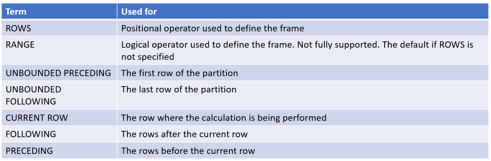

DEFAUTL is `RANGE BETWEEN UNBOUNDED PRECEDING AND CURRENT ROW`

```
SELECT CustomerID, 
	SalesOrderID, 
	TotalDue, 
	OrderDate,
	SUM(TotalDue) OVER(PARTITION BY CustomerID ORDER BY OrderDate) 
           AS RunningTotal,
	SUM(TotalDue) OVER(PARTITION BY CustomerID ORDER BY OrderDate
	   ROWS BETWEEN UNBOUNDED PRECEDING AND CURRENT ROW) 
              AS CorrectRunningTotal 
FROM Sales.SalesOrderHeader
WHERE CustomerID IN ('11433','11078','18758');
```

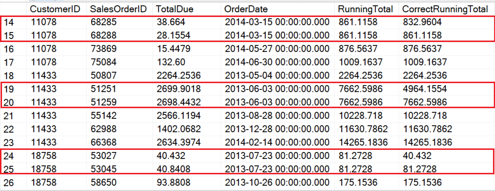

**Performance**\
Using window functions can cause either performance gain and some IO impact, so it should be used with care.

```
SELECT ProductID, SUM(ActualCost) OVER(PARTITION BY ProductID 
   ORDER BY TransactionDate 
   ROWS BETWEEN UNBOUNDED PRECEDING AND CURRENT ROW) 
    AS RunningTotal
FROM bigTransactionHistory;
```


```
WITH Calcs AS (
	SELECT ProductID,
		AVG(ActualCost) AS AvgCost, 
		MIN(ActualCost) AS MinCost,
		MAX(ActualCost) AS MaxCost
	FROM bigTransactionHistory
	GROUP BY ProductID)
SELECT O.ProductID, 
	ActualCost,
	AvgCost, 
	MinCost,
	MaxCost 
FROM bigTransactionHistory AS O 
JOIN Calcs ON O.ProductID = Calcs.ProductID;
```

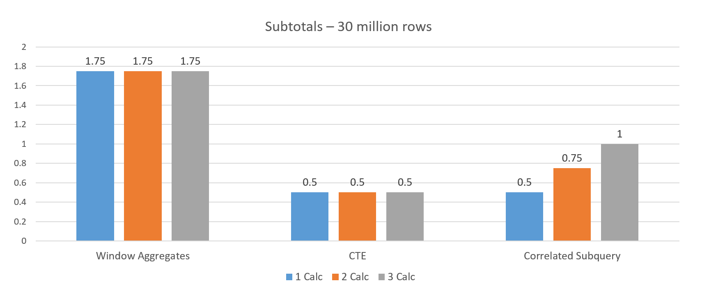

---
<!-- _class: slide -->
# Transactions
A transaction is a sequence of operations performed as a single logical unit of work. A logical unit of work must exhibit four properties, called the atomicity, consistency, isolation, and durability (ACID) properties, to qualify as a transaction.

## ACID
 - **Atomicity** - a transaction must be an atomic unit of work. Either all of its data modifications are performed, or none of them are performed.

 - **Consistency** - when completed, a transaction must leave all data in a consistent state. In a relational database, all rules must be applied to the transaction's modifications to maintain all data integrity. All internal data structures, such as B-tree indexes or doubly-linked lists, must be correct at the end of the transaction.

 - **Isolation** - modifications made by concurrent transactions must be isolated from the modifications made by any other concurrent transactions. A transaction either recognizes data in the state it was in before another concurrent transaction modified it, or it recognizes the data after the second transaction has completed, but it does not recognize an intermediate state.

 - **Durability** - after a fully durable transaction has completed, its effects are permanently in place in the system. The modifications persist even in the event of a system failure. SQL Server 2014 (12.x) and later enable delayed durable transactions. Delayed durable transactions commit before the transaction log record is persisted to disk.

 SQL Server Database Engine ACID facilities:
  - Locking facilities that preserve transaction isolation.
  - Logging facilities ensure transaction durability. For fully durable transactions the log record is hardened to disk before the transactions commits.
  - Transaction management features that enforce transaction atomicity and consistency.

## SQL Server transactions

 - **Autocommit transactions** - Each individual statement is a transaction.

 - **Explicit transactions** - Each transaction is explicitly started with the BEGIN TRANSACTION statement and explicitly ended with a COMMIT or ROLLBACK statement.

 - **Implicit transactions** - A new transaction is implicitly started when the prior transaction completes, but each transaction is explicitly completed with a COMMIT or ROLLBACK statement.

## Concurrency
Users modifying data can affect other users who are reading or modifying the same data at the same time. These users are said to be accessing the data concurrently.

Types of concurrency control:
 - **Pessimistic** concurrency control - a system of locks prevents users from modifying data in a way that affects other users.

  - **Optimistic concurrency control** - users do not lock data when they read it. When a user updates data, the system checks to see if another user changed the data after it was read.

Concurrency effects:
 - **Uncommitted dependency (dirty read)** - occurs when a second transaction selects a row that is being updated by another transaction. The second transaction is reading data that has not been committed yet and may be changed by the transaction updating the row.
 - **Inconsistent analysis (nonrepeatable read)** - occurs when a second transaction accesses the same row several times and reads different data each time. 
 - **Phantom reads** - A phantom read is a situation that occurs when two identical queries are executed and the collection of rows returned by the second query is different.

## Isolation levels
Transactions specify an isolation level that defines the degree to which one transaction must be isolated from resource or data modifications made by other transactions. Isolation levels are described in terms of which concurrency side-effects, such as dirty reads or phantom reads, are allowed.

Database Engine Isolation Levels:
 - **Read uncommitted** - the lowest isolation level where transactions are isolated only enough to ensure that physically corrupt data is not read.
 - **Read committed** - allows a transaction to read data previously read (not modified) by another transaction without waiting for the first transaction to complete.
 - **Repeatable read** - the SQL Server Database Engine keeps read and write locks that are acquired on selected data until the end of the transaction.
 - **Serializable** - the highest level where transactions are completely isolated from one another. The SQL Server Database Engine keeps read and write locks acquired on selected data to be released at the end of the transaction.

Isolation level | Dirty read | Nonrepeatable read | Phantom
--- | --- | --- | ---
**Read uncommitted** | Yes | Yes | Yes
**Read committed**	| No | Yes | Yes
**Repeatable read**	| No | No | Yes
**Serializable** | No | No | No

## Locks Granularity and Models
To minimize the cost of locking, the SQL Server Database Engine locks resources automatically at a level appropriate to the task. Locking at a smaller granularity, such as rows, increases concurrency but has a higher overhead because more locks must be held if many rows are locked.

Resource | Description
--- | ---
RID | A row identifier used to lock a single row within a heap.
KEY | A row lock within an index used to protect key ranges in serializable transactions.
PAGE | An 8-kilobyte (KB) page in a database, such as data or index pages.
EXTENT | A contiguous group of eight pages, such as data or index pages.
HoBT | A heap or B-tree. A lock protecting a B-tree (index) or the heap data pages in a table that does not have a clustered index.
TABLE | The entire table, including all data and indexes.
FILE | A database file.
APPLICATION | An application-specified resource.
METADATA | Metadata locks.
ALLOCATION_UNIT | An allocation unit.
DATABASE | The entire database.

The SQL Server Database Engine locks resources using different lock modes that determine how the resources can be accessed by concurrent transactions.

Lock mode | Description
--- | ---
**Shared (S)** | Used for read operations that do not change or update data, such as a SELECT statement.
**Update (U)** | Used on resources that can be updated. Prevents a common form of deadlock that occurs when multiple sessions are reading, locking, and potentially updating resources later.
**Exclusive (X)** | Used for data-modification operations, such as INSERT, UPDATE, or DELETE. Ensures that multiple updates cannot be made to the same resource at the same time.
**Intent** | Used to establish a lock hierarchy. The types of intent locks are: intent shared (IS), intent exclusive (IX), and shared with intent exclusive (SIX).
**Schema** | Used when an operation dependent on the schema of a table is executing. The types of schema locks are: schema modification (Sch-M) and schema stability (Sch-S).
**Bulk Update (BU)** | Used when bulk copying data into a table and the TABLOCK hint is specified.

**Deadlocks**\
A deadlock occurs when two or more tasks permanently block each other by each task having a lock on a resource which the other tasks are trying to lock. For example:

 - Transaction A acquires a shared lock on row 1.
 - Transaction B acquires a shared lock on row 2.
 - Transaction A now requests an exclusive lock on row 2, and is - blocked until transaction B finishes and releases the shared lock it has on row 2.
 - Transaction B now requests an exclusive lock on row 1, and is blocked until transaction A finishes and releases the shared lock it has on row 1.

*SHOW EXAMPLE WITH NOLOCK TABLE HINT AND LOCKS*

---
<!-- _class: slide -->
