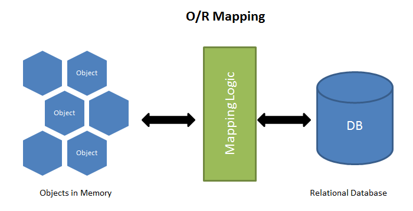
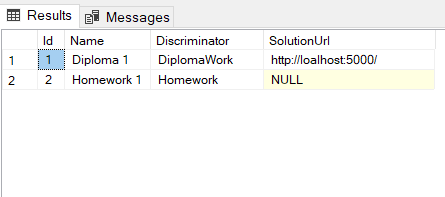

# Entity Framework 6 and Core

---
<!-- _class: slide -->

# ORM
ORM stands for **Object Relational Mapping**. And it is a programming technique for converting data between incompatible type systems using object-oriented programming languages.



---
<!-- _class: slide -->
# EF6

Entity Framework 6 (EF6) is a tried and tested object-relational mapper (O/RM) for .NET. EF6 implements many popular O/RM features:
 - Mapping of **POCO** entity classes which do not depend on any EF types
 - Automatic change tracking
 - Identity resolution and Unit of Work
 - Eager, lazy and explicit loading
 - Translation of strongly-typed queries using LINQ (Language INtegrated Query)
 - Rich mapping capabilities, including support for:
   * One-to-one, one-to-many and many-to-many relationships
   * Inheritance (table per hierarchy, table per type and table per concrete class)
 - Complex types
 - Stored procedures
 - A visual designer to create entity models.
 - A "Code First" experience to create entity models by writing code.
 - Models can either be generated from existing databases and then hand-edited, or they can be created from scratch and then used to generate new databases.
 - Integration with .NET Framework application models, including ASP.NET, and through databinding, with WPF and WinForms.
 - Database connectivity based on ADO.NET and numerous providers available to connect to SQL Server, Oracle, MySQL, SQLite, PostgreSQL, DB2, etc.

---
<!-- _class: slide -->
# Entity Framework Core
Entity Framework (EF) Core is a lightweight, extensible, open source and cross-platform version of the popular Entity Framework data access technology. EF Core can serve as an object-relational mapper (O/RM), which:

 - Enables .NET developers to work with a database using .NET objects.
 - Eliminates the need for most of the data-access code that typically needs to be written.
 - Automatic change tracking 
 - Translation of strongly-typed queries using LINQ (Language INtegrated Query)
 - It supports updates and schema migrations
 - Works with SQL Server/SQL Azure, SQLite, Azure Cosmos DB, MySQL, PostgreSQL, and many more databases through a database provider plugin model.

---
<!-- _class: slide -->
# Getting Started with EF Core
The following software is required to use EF Core: [.NET Core SDK](https://www.microsoft.com/net/download/core).

## Create a new project
```
dotnet new console -o TMS.NET06.Lesson26.EFCore
cd TMS.NET06.Lesson26.EFCore
```

## Install Entity Framework Core
To install EF Core, you install the package for the EF Core database provider(s) you want to target. For a list of available providers, see [Database Providers](https://docs.microsoft.com/en-us/ef/core/providers/).

```
dotnet add package Microsoft.EntityFrameworkCore.SqlServer
```
## Choose the Modeling approach
EF Core provides two primary ways of keeping your EF Core model and database schema in sync.

 - **EF Core model** as the source of truth (i.e. Code First approach).
    As you make changes to your EF Core model, use **Migrations** to apply corresponding schema changes to your database so that it remains compatible with your EF Core model.
 - **Database schema** as the source of truth (i.e. Database First).
    As you make changes to Databse Schema the EF Core model should be updated manually or the **Reverse engineering (scaffolding)** can be used to generate models with corresponding schema changes.

## Define Entities
We are startign with a Code First approach, so accordign to our business logic we should define some Entity classes, that will describe identifiable objects within business context. One of common ways to do so is to use a **POCO** approach. POCO stands for
```
public class Student 
{
    public int Id { get; set; }
    public string Name { get; set; }
    public string LastName { get; set; }
    public DateTime BirthDate { get; set; }
}
```

*TODO: DEFINE ENTITY CLASSES*

## Define DbContext
A `DbContext` instance represents a session with the database and can be used to query and save instances of your entities. DbContext is a combination of the Unit Of Work and Repository patterns.

### Configuring the database provider
Each `DbContext` instance must be configured to use one and only one database provider. (Different instances of a `DbContext` subtype can be used with different database providers, but a single instance must only use one.) A database provider is configured using a specific Use*" call. For example, to use the SQL Server database provider
```
public class ApplicationDbContext : DbContext
{
    protected override void OnConfiguring(DbContextOptionsBuilder optionsBuilder)
    {
        optionsBuilder.UseSqlServer(@"Server=(localdb)\mssqllocaldb;Database=Test");
    }
}
```

 ## Create and configure a model
 Entity Framework Core uses a set of conventions to build a model based on the shape of your entity classes. You can specify additional configuration to supplement and/or override what was discovered by convention.

### Add Entities to DbContext
First step is to define sets that will allow to make manipulations with your entities. Including a DbSet of a type on your context means that it is included in EF Core's model (usually refered as *entity*). Entity types that are specified in the `OnModelCreating` method are also included, as are any types that are found by recursively exploring the *navigation properties* of other discovered entity types.
 ```
internal class TMSContext : DbContext
{
    public DbSet<Student> Students { get; set; }
    
    protected override void OnModelCreating(ModelBuilder modelBuilder)
    {
	    modelBuilder.Entity<Homework>();
    }
}
 ```

If you don't want a type to be included in the model, you can exclude it:
```
internal class TMSContext : DbContext
{
    public DbSet<Student> Students { get; set; }
    
    protected override void OnModelCreating(ModelBuilder modelBuilder)
    {
        modelBuilder.Entity<Homework>();
        modelBuilder.Ignore<NonEntity>();
    }
}
```
```
[NotMapped]
public class AnotherNonEntity
{
    public string Data { get; set; }
}
```

By convention, each entity type will be set up to map to a database table with the same name as the DbSet property that exposes the entity. If no DbSet exists for the given entity, the class name is used.\
You can manually configure the table name:
```
internal class TMSContext : DbContext
{
    public DbSet<Student> Students { get; set; }
    
    protected override void OnModelCreating(ModelBuilder modelBuilder)
    {
        modelBuilder.Entity<Homework>()
                    .ToTable("homeworks");
    }
}
```
```
[Table("homeworks")]
public class Homework
{
    public string Name { get; set; }
}
```

 ### Use fluent API to configure a model
 Along with a Unit of Work representation DbContext can be used to define the **MAPPING** between the database and your entities.
 You can override the OnModelCreating method in your derived context and use the ModelBuilder API to configure your model. Fluent API configuration has the highest precedence and will override conventions and data annotations.
 ```
 internal class TMSContext : DbContext
{
    public DbSet<Student> Students { get; set; }
    public DbSet<Homework> Homeworks { get; set; }

    protected override void OnModelCreating(ModelBuilder modelBuilder)
    {
	    modelBuilder.Entity<Homework>()
		    .Property(h => h.Name)
		    .IsRequired();
    }
}
 ```

 ### Use data annotations to configure a model
You can also apply attributes (known as Data Annotations) to your classes and properties. Data annotations will override conventions, but will be overridden by Fluent API configuration.
 ```
 public class Homework 
 {
     [Required]
     public string Name { get; set; }
 }
 ```

 ## Mapping Model to Database
 Each entity type in your model has a set of properties, which EF Core will read and write from the database. If you're using a relational database, entity properties map to table columns.

### Included and excluded properties
By convention, all public properties with a getter and a setter will be included in the model.\
Specific properties can be excluded as follows:
```
protected override void OnModelCreating(ModelBuilder modelBuilder)
{
    modelBuilder.Entity<Homework>()
        .Ignore(h => h.Lesson);
}
```
```
public class Homework 
{
    [NotMapped]
    public string Lesson { get; set; }
}
```

### Column names
By convention, when using a relational database, entity properties are mapped to table columns having the same name as the property.\
You can specify column name as follows:
```
protected override void OnModelCreating(ModelBuilder modelBuilder)
{
    modelBuilder.Entity<Homework>()
        .Property(h => h.Name)
        .HasColumnName("name");
}
```
```
 public class Homework 
 {
     [Column("name")]
     public string Name { get; set; }
 }
 ```

 ### Column data types
 When using a relational database, the database provider selects a data type based on the .NET type of the property. It also takes into account other metadata, such as the configured maximum length, whether the property is part of a primary key, etc.

For example, SQL Server maps DateTime properties to datetime2(7) columns, and string properties to nvarchar(max) columns (or to nvarchar(450) for properties that are used as a key).
```
protected override void OnModelCreating(ModelBuilder modelBuilder)
{
    modelBuilder.Entity<Homework>(
        h => 
        {
            h.Property(h => h.Name).HasColumnType("nvarchar(150)")        
        });
}
```
```
 public class Homework 
 {
     [Column(TypeName = "nvarchar(150)")]
     public string Name { get; set; }
 }
 ```

### Maximum length
In the following example, configuring a maximum length of 500 will cause a column of type nvarchar(500) to be created on SQL Server:
```
protected override void OnModelCreating(ModelBuilder modelBuilder)
{
    modelBuilder.Entity<Homework>()
        .Property(h => h.Name)
        .HasMaxLength(500);
}
```
```
 public class Homework 
 {
     [MaxLength(500)]
     public string Name { get; set; }
 }
```

### Precision and Scale
In the following example, configuring the BirthDate property to have precision 3 will cause a column of type datetime2(3) to be created on SQL Server (precision and scale cannot currently be configured via data annotations.).
```
protected override void OnModelCreating(ModelBuilder modelBuilder)
{
    modelBuilder.Entity<Student>()
        .Property(s => s.BirthDate)
        .HasMaxLength(3);
}
```

### Required and optional properties
A property is considered optional if it is valid for it to contain null. If null is not a valid value to be assigned to a property then it is considered to be a required property. When mapping to a relational database schema, required properties are created as non-nullable columns, and optional properties are created as nullable columns.

**Conventions**
By convention, a property whose .NET type can contain null will be configured as optional, whereas properties whose .NET type cannot contain null will be configured as required. For example, all properties with .NET value types (int, decimal, bool, etc.) are configured as required, and all properties with nullable .NET value types (int?, decimal?, bool?, etc.) are configured as optional.

C# 8 introduced a new feature called nullable reference types (NRT), which allows reference types to be annotated, indicating whether it is valid for them to contain null or not. This feature is disabled by default, and affects EF Core's behavior in the following way:

If nullable reference types are disabled (the default), all properties with .NET reference types are configured as optional by convention (for example, string).
If nullable reference types are enabled, properties will be configured based on the C# nullability of their .NET type: string? will be configured as optional, but string will be configured as required.
The following example shows an entity type with required and optional properties, with the nullable reference feature disabled (the default) and enabled
```
protected override void OnModelCreating(ModelBuilder modelBuilder)
{
    modelBuilder.Entity<Student>()
        .Property(s => s.Name)
        .IsRequired();
}
```
```
public class Student 
{
    [Required]
    public string Name { get; set; }
}
```
```
<Nullable>enable</Nullable>

public class Student 
{
    public string Name { get; set; } // Required by convention
    public string? LastName { get; set; } // Optional by convention
}
```

### Keys
A key serves as a unique identifier for each entity instance. By convention, a property named Id or <type name>Id will be configured as the primary key of an entity.
```
public class Student 
{
    public in Id { get; set; }

    public string Name { get; set; }
    public string LastName { get; set; }
}
```

You can configure a single property to be the primary key of an entity as follows:
```
protected override void OnModelCreating(ModelBuilder modelBuilder)
{
    modelBuilder.Entity<Student>()
        .HasKey(c => c.Id);
}
```
```
public class Student 
{
    [Key]
    public in Id { get; set; }
}
```

You can also configure multiple properties to be the key of an entity - this is known as a composite key.
```
protected override void OnModelCreating(ModelBuilder modelBuilder)
{
    modelBuilder.Entity<Student>()
        .HasKey(s => new { s.Name, s.LastName });
}
```
**Value generation**
For non-composite numeric and GUID primary keys, EF Core sets up value generation for you by convention. For example, a numeric primary key in SQL Server is automatically set up to be an IDENTITY column.

### Relationships
A relationship defines how two entities relate to each other. In a relational database, this is represented by a foreign key constraint.

**Definition of terms**
There are a number of terms used to describe relationships

 - **Dependent entity**: This is the entity that contains the foreign key properties. Sometimes referred to as the 'child' of the relationship.

 - **Principal entity**y: This is the entity that contains the primary/alternate key properties. Sometimes referred to as the 'parent' of the relationship.

 - **Principal key**: The properties that uniquely identify the principal entity. This may be the primary key or an alternate key.

 - **Foreign key**: The properties in the dependent entity that are used to store the principal key values for the related entity.

 - **Navigation propert**y: A property defined on the principal and/or dependent entity that references the related entity.

   * **Collection navigation property**: A navigation property that contains references to many related entities.

   * **Reference navigation property**: A navigation property that holds a reference to a single related entity.

   * **Inverse navigation property**: When discussing a particular navigation property, this term refers to the navigation property on the other end of the relationship.

 - **Self-referencing relationship**: A relationship in which the dependent and the principal entity types are the same.

 You can define one-to-many relationship as follows:
 ```
 // Principal Entity
public class Student 
{   
    public int Id { get; set; } // Principal Key

    public string Name { get; set; }
    public string LastName { get; set; }
    public DateTime BirthDate { get; set; }

    public List<Homework> Homeworks { get; set; } // Collection Navigation Property
}

// Dependent Entity
public class Homework
{
    public int Id { get; set; }
    public string Name { get; set; }
    public int? Mark { get; set; }
    public bool IsComplete { get; set; }

    
    public int StudentId { get; set; } // Foreign Key    
    public Student Student { get; set; } // Reference Navigation Property
}
```

**No foreign key property**
While it is recommended to have a foreign key property defined in the dependent entity class, it is not required.
```
public class Student 
{   
    public int Id { get; set; } 
    public string Name { get; set; }
    public string LastName { get; set; }
    public DateTime BirthDate { get; set; }

    public List<Homework> Homeworks { get; set; }
}

public class Homework
{
    public int Id { get; set; }
    public string Name { get; set; }
    public int? Mark { get; set; }
    public bool IsComplete { get; set; }
    
    public Student Student { get; set; }
}
```

**Single navigation property**
Including just one navigation property (no inverse navigation, and no foreign key property) is enough to have a relationship defined by convention. You can also have a single navigation property and a foreign key property.
```
public class Student 
{   
    public int Id { get; set; } 
    public string Name { get; set; }
    public string LastName { get; set; }
    public DateTime BirthDate { get; set; }

    public List<Homework> Homeworks { get; set; }
}
```

**Manual Configuration**
After the navigation property has been created, you may need to further configure it.
```
protected override void OnModelCreating(ModelBuilder modelBuilder)
{
    modelBuilder.Entity<Homework>()
        .HasOne(h => h.Student)
        .WithMany(s => s.Homeworks)
        .HasForeignKey(h => h.StudentId);
}
```
```
public class Homework
{
    public int Id { get; set; }
    public string Name { get; set; }
    public int? Mark { get; set; }
    public bool IsComplete { get; set; }
    
    public int StudentId { get; set; }

    [ForeignKey("StudentId")]
    public Student Student { get; set; }
}
```

You can use the string overload of HasForeignKey(...) to configure a shadow property as a foreign key.
```
protected override void OnModelCreating(ModelBuilder modelBuilder)
{
    // Add the shadow property to the model
    modelBuilder.Entity<Homework>()
        .Property<int>("StudentForeignKey");   

    modelBuilder.Entity<Homework>()
        .HasOne(h => h.Student)
        .WithMany(s => s.Homeworks)
        .HasForeignKey("StudentForeignKey");
}

public class Student 
{   
    public int Id { get; set; }
    public string Name { get; set; }

    public List<Homework> Homeworks { get; set; }
}

public class Homework
{
    public int Id { get; set; }
    public string Name { get; set; }

    public Student Student { get; set; }
}
```

**Required and optional relationships**
The foreign key properties are located on the dependent entity type, so if they are configured as required it means that every dependent entity is required to have a corresponding principal entity.
```
protected override void OnModelCreating(ModelBuilder modelBuilder)
{
    modelBuilder.Entity<Homework>()
        .HasOne(h => h.Student)
        .WithMany(s => s.Homeworks)
        .IsRequired();
}
```

**Cascade delete**
You can use the Fluent API to configure the cascade delete behavior for a given relationship explicitly.
```
protected override void OnModelCreating(ModelBuilder modelBuilder)
{
    modelBuilder.Entity<Homework>()
        .HasOne(h => h.Student)
        .WithMany(s => s.Homeworks)
        .OnDelete(DeleteBehavior.Cascade);
}
```

**One-to-one**
One to one relationships have a reference navigation property on both sides.
```
public class Student
{   
    public int Id { get; set; }
    public string Name { get; set; }

    public StudentAvatar Avatar { get; set; }
}

public class StudentAvatar
{   
    public int Id { get; set; }
    public byte[] Image { get; set; }
    public string Caption { get; set; }

    public int StudentId { get; set; }
    public Student Student { get; set; }
}
```
```
    protected override void OnModelCreating(ModelBuilder modelBuilder)
    {
        modelBuilder.Entity<Student>()
            .HasOne(s => s.StudentAvatar)
            .WithOne(a => a.Student)
            .HasForeignKey<StudentAvatar>(a => a.StudentId);
    }
```

**Many-to-many**
Many to many relationships require a collection navigation property on both sides. They will be discovered by convention like other types of relationships.
```
public class Homework
{
    public int Id { get; set; }
    public string Name { get; set; }

    public ICollection<Tag> Tags { get; set; }
}

public class Tag
{
    public string Id { get; set; }

    public ICollection<Homework> Homeworks { get; set; }
}
```
```
protected override void OnModelCreating(ModelBuilder modelBuilder)
{
    modelBuilder.Entity<Homework>()
        .HasMany(h => h.Tags)
        .WithMany(t => t.Homeworks)
        .UsingEntity(j => j.ToTable("HomeworkTag")); // Join entity type configuration
}
```

You can also represent a many-to-many relationship by just adding the join entity type and mapping two separate one-to-many relationships.
```
protected override void OnModelCreating(ModelBuilder modelBuilder)
{
    modelBuilder.Entity<HomeworkTag>()
        .HasKey(ht => new { ht.HomeworkId, ht.TagId });

    modelBuilder.Entity<HomeworkTag>()
        .HasOne(ht => ht.Homework)
        .WithMany(h => h.HomeworkTags)
        .HasForeignKey(ht => ht.HomeworkId);

    modelBuilder.Entity<HomeworkTag>()
        .HasOne(ht => ht.Tag)
        .WithMany(t => t.HomeworkTags)
        .HasForeignKey(ht => ht.TagId);
}

public class Homework
{
    public int Id { get; set; }
    public string Name { get; set; }

    public List<HomeworkTag> HomeworkTags { get; set; }
}

public class Tag
{
    public string Id { get; set; }

    public List<HomeworkTag> HomeworkTags { get; set; }
}

public class HomeworkTag
{
    public int HomeworkId { get; set; }
    public Homework Homework { get; set; }

    public string TagId { get; set; }
    public Tag Tag { get; set; }
}
```

### Indexes
You can specify an index over a column as follows:
```
[Index(nameof(Name /*, IsUnique = true*/))]
public class Student
{   
    public int Id { get; set; }
    public string Name { get; set; }

    public StudentAvatar Avatar { get; set; }
}
```
```
protected override void OnModelCreating(ModelBuilder modelBuilder)
{
    modelBuilder.Entity<Student>()
        .HasIndex(b => b.Name);
      //.IsUnique();
}
```

**Composite index**
```
[Index(nameof(Name), nameof(LastName))]
public class Student
{   
    public int Id { get; set; }
    public string Name { get; set; }
    public string LastName { get; set; }

    public StudentAvatar Avatar { get; set; }
}
```
```
protected override void OnModelCreating(ModelBuilder modelBuilder)
{
    modelBuilder.Entity<Student>()
        .HasIndex(p => new { p.Name, p.LastName });
}
```

**Included columns**
Some relational databases allow you to configure a set of columns which get included in the index, but aren't part of its "key".
```
protected override void OnModelCreating(ModelBuilder modelBuilder)
{
    modelBuilder.Entity<Student>()
        .HasIndex(b => b.Name);
        .IncludeProperties(
            s => new { s.BirthDate, s.LastName });
}
```

## Inheritance
EF can map a .NET type hierarchy to a database. This allows you to write your .NET entities in code as usual, using base and derived types, and have EF seamlessly create the appropriate database schema, issue queries, etc.

### Entity type hierarchy mapping
By convention, EF will not automatically scan for base or derived types; this means that if you want a CLR type in your hierarchy to be mapped, you must explicitly specify that type on your model. For example, specifying only the base type of a hierarchy will not cause EF Core to implicitly include all of its sub-types.
```
internal class TMSContext : DbContext
{
    public DbSet<Homework> Homeworks { get; set; }
    public DbSet<DiplomaWork> DiplomaWorks { get; set; }
}

public class DiplomaWork : Homework
{
    public string SolutionUrl { get; set; }
}
```
```
protected override void OnModelCreating(ModelBuilder modelBuilder)
{
    modelBuilder.Entity<DiplomaWork>()
        .HasBaseType<Homework>();
      //.HasBaseType((Type)null) // to remove an entity type from the hierarchy
}
```

### Table-per-hierarchy and discriminator configuration
By default, EF maps the inheritance using the table-per-hierarchy (TPH) pattern. TPH uses a single table to store the data for all types in the hierarchy, and a **`Discriminator`** column is used to identify which type each row represents.



You can configure the name and type of the discriminator column and the values that are used to identify each type in the hierarchy:
```
protected override void OnModelCreating(ModelBuilder modelBuilder)
{
    modelBuilder.Entity<Homework>()
        .HasDiscriminator<string>("work_type")
        .HasValue<Homework>("regular")
        .HasValue<DiplomaWork>("diploma");
}   
```

*By default, EF added the discriminator implicitly as a shadow property on the base entity of the hierarchy. This property can be configured like any other can also be mapped to a regular .NET property in your entity*

If your database contains rows with discriminator values, which aren't mapped in the EF model, then you can mark the discriminator mapping in EF Core model as **incomplete** to indicate that we should always add filter predicate for querying any type in the hierarchy:
```
protected override void OnModelCreating(ModelBuilder modelBuilder)
{
    modelBuilder.Entity<Homework>()
        .HasDiscriminator()
        .IsComplete(false);
}
```

### Table-per-type configuration
*The table-per-type (TPT) feature was introduced in EF Core 5.0. Table-per-concrete-type (TPC) is supported by EF6, but is not yet supported by EF Core.*

In the TPT mapping pattern, all the types are mapped to individual tables. Properties that belong solely to a base type or derived type are stored in a table that maps to that type. Tables that map to derived types also store a foreign key that joins the derived table with the base table.
```
modelBuilder.Entity<Homework>().ToTable("Homework");
modelBuilder.Entity<DiplomaWork>().ToTable("Diplomas");
```

## Value Conversions
Value converters allow property values to be converted when reading from or writing to the database.

Conversions are defined using two Func expression trees: one from `ModelClrType` to `ProviderClrType` and the other from `ProviderClrType` to `ModelClrType`.
```
protected override void OnModelCreating(ModelBuilder modelBuilder)
{
    modelBuilder
        .Entity<Homework>()
        .Property(e => e.Type)
        .HasConversion(
            v => v.ToString(), // from `ModelClrType` to `ProviderClrType`
            v => (HomeworkType)Enum.Parse(typeof(HomeworkType), v)); // from `ProviderClrType` to `ModelClrType`
}
```

### Pre-defined conversions
EF Core contains many pre-defined conversions that avoid the need to write conversion functions manually. Instead, EF Core will pick the conversion to use based on the property type in the model and the requested database provider type.
```
protected override void OnModelCreating(ModelBuilder modelBuilder)
{
    modelBuilder
        .Entity<Homework>()
        .Property(e => e.Type)
        .HasConversion<string>();
}
```
```
protected override void OnModelCreating(ModelBuilder modelBuilder)
{
    modelBuilder
        .Entity<Homework>()
        .Property(e => e.Type)
        .HasColumnType("nvarchar(24)");
}
```
```
public class Homework
{
    public int Id { get; set; }

    [Column(TypeName = "nvarchar(24)")]
    public HomeworkType Type { get; set; }
}
```

### Simple value objects
 This can be useful when you want the type in your model to be more specific (and hence more type-safe) than a primitive type. In this example, that type is Dollars, which wraps the decimal primitive:
 ```
public class Homework
{
    public int Id { get; set; }

    public Mark Mark { get; set; }
}

public readonly struct Mark
{
    public Mark(int? mark) => Value = mark;

    public int? Value { get; }

    public override string ToString() => Value switch
    {
        {} v when v <= 3 => "neud",
        {} v when v > 3 && v <= 7 => "good",
        {} v when v > 7 => "excelent",
        _ => "undefined"
    };
}

protected override void OnModelCreating(ModelBuilder modelBuilder)
{
    modelBuilder
        .Entity<Homework>()
        .Property(e => e.Mark)
        .HasConversion(
            v => v.Value,
            v => new Mark(v));
}
```

### Composite Value objects, collections of primitives and Value objects
The value object can be used in an entity type as well as collection of value objects and a collection of primitive values. For example:
```
public class Homework
{
    public int Id { get; set; }
    
    public ICollection<string> Tags { get; set; }
}

protected override void OnModelCreating(ModelBuilder modelBuilder)
{
    modelBuilder.Entity<Homework>()
        .Property(e => e.Tags)
        .HasConversion(
            v => JsonSerializer.Serialize(v, null),
            v => JsonSerializer.Deserialize<List<string>>(v, null));
}
```

## Owned Entity Types
EF Core allows you to model entity types that can only ever appear on navigation properties of other entity types. These are called owned entity types. The entity containing an owned entity type is its owner. Owned entities are essentially a part of the owner and cannot exist without it, they are conceptually similar to DDD aggregates. 

Owned entity types are never included by EF Core in the model by convention.
```
public class Student
{
    public int Id { get; set; }
    
    public StreetAddress Address { get; set; }
}
```
```
[Owned]
public class StreetAddress
{
    public string Street { get; set; }
    public string City { get; set; }
}
```
```
public class StreetAddress
{
    public string Street { get; set; }
    public string City { get; set; }
}

protected override void OnModelCreating(ModelBuilder modelBuilder)
{
    modelBuilder.Entity<Order>().OwnsOne(p => p.Address);
}
```
The model above is mapped to the following database schema:\


## Keyless Entity Types
In addition to regular entity types, an EF Core model can contain keyless entity types, which can be used to carry out database queries against data that doesn't contain key values.
```
[Keyless]
public class HomeworksCount
{
    public string StudentName { get; set; }
    public int HomeworksCount { get; set; }
}
```
```
protected override void OnModelCreating(ModelBuilder modelBuilder)
{
    modelBuilder.Entity<HomeworksCount>()
        .HasNoKey();
}
```

Keyless Entity Types different from regular entity types in that they:
 
 - Cannot have a key defined.
 - Are never tracked for changes in the DbContext and therefore are never inserted, updated or deleted on the database.
 - Are never discovered by convention.
 - Only support a subset of navigation mapping capabilities, specifically:
    * They may never act as the principal end of a relationship.
    * They may not have navigations to owned entities
    * They can only contain reference navigation properties pointing to regular entities.
    * Entities cannot contain navigation properties to keyless entity types.
 - Need to be configured with a [Keyless] data annotation or a .HasNoKey() method call.
 - May be mapped to a defining query. A defining query is a query declared in the model that acts as a data source for a keyless entity type.

**Usage scenarios**
 - Serving as the return type for raw SQL queries.
 - Mapping to database views that do not contain a primary key.
 - Mapping to tables that do not have a primary key defined.
 - Mapping to queries defined in the model.

### Mapping to database objects
Define a simple database view that will allow us to query the number of homeworks associated with each student:
```
db.Database.ExecuteSqlRaw(
    @"CREATE VIEW View_HomeworksCounts AS
        SELECT h.Name, Count(s.Id) as HomeworksCount
        FROM Homeworks h
        JOIN Students s on s.Id = h.StudentId
        GROUP BY s.Name");
```

Configure the keyless entity type in `OnModelCreating` using the `HasNoKey` API. We use fluent configuration API to configure the mapping for the keyless entity type:
```
protected override void OnModelCreating(ModelBuilder modelBuilder)
{
    modelBuilder
        .Entity<HomeworksCount>(
            hc =>
            {
                hc.HasNoKey();
                hc.ToView("View_HomeworksCounts");
                hc.Property(v => v.StudentkName).HasColumnName("Name");
            });
}
```


